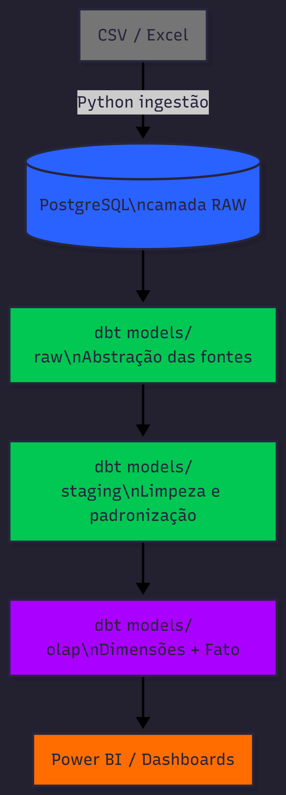
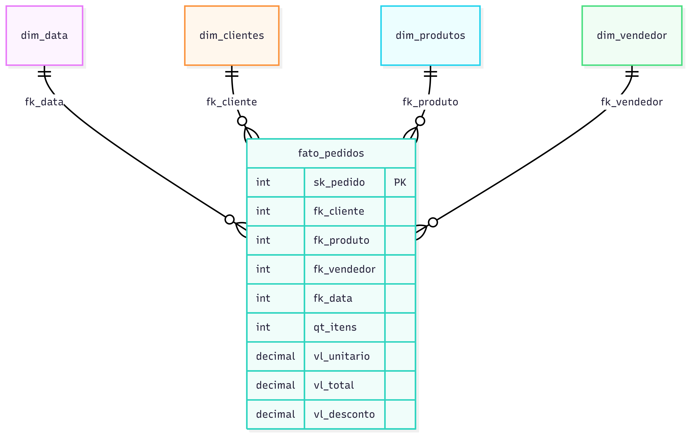
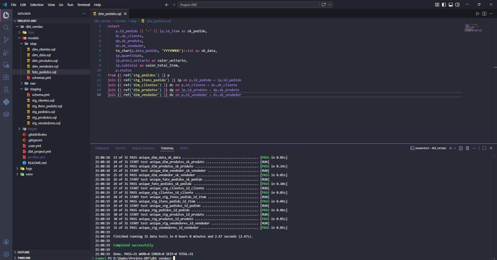
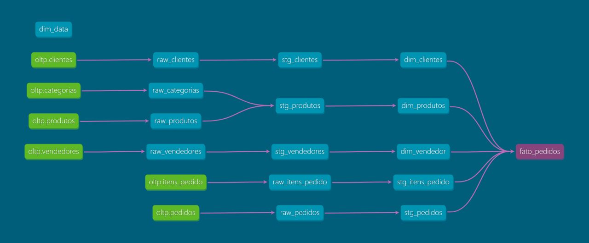

# 📊 Data Warehouse com dbt, SQL e PostgreSQL

Pipeline completo de engenharia de dados — da ingestão de arquivos brutos até um modelo dimensional pronto para dashboards. Projeto aplicando **dbt**, **PostgreSQL** e **Python**, com arquitetura em camadas Raw → Staging → OLAP.

---

## 🎯 Objetivo

Transformar dados brutos (CSV/Excel) em um modelo dimensional confiável e rastreável, utilizando as melhores práticas de transformação com dbt: testes de qualidade, documentação automática e dependências declaradas via `ref()`.

---

## 🏗️ Arquitetura

<div align="center">
  
</div>

---

## 🔄 Camadas do Pipeline

### 1. Ingestão — Python

Leitura de arquivos CSV/Excel e carga no PostgreSQL via Python, populando a camada RAW com os dados brutos sem transformação.

### 2. Raw — `models/raw/`

Primeira abstração no dbt. Os modelos referenciam diretamente as tabelas carregadas, mapeadas via `sources.yml`. Nenhuma transformação — só visibilidade e rastreabilidade.

```
raw_categorias.sql
raw_clientes.sql
raw_itens_pedido.sql
raw_pedidos.sql
raw_produtos.sql
raw_vendedores.sql
sources.yml         ← declaração das fontes
schema.yml          ← documentação e testes
```

### 3. Staging — `models/staging/`

Limpeza e padronização. Cada modelo `stg_*` vem de uma única `raw_*` — sem joins entre tabelas diferentes.

- Padronização de nomes (`snake_case`)
- Casting de tipos de dados
- `COALESCE`, `TRIM` e remoção de nulos
- Renomeação de colunas para clareza

```
stg_clientes.sql
stg_itens_pedido.sql
stg_pedidos.sql
stg_produtos.sql
stg_vendedores.sql
schema.yml
```

### 4. OLAP — `models/olap/`

Modelagem dimensional com surrogate keys, dimensões e tabela fato prontas para análise.

```
dim_clientes.sql
dim_data.sql
dim_produtos.sql
dim_vendedor.sql
fato_pedidos.sql
schemas.yml
```

---

## 📐 Modelagem — Star Schema


<div align="center">
  
</div>

---

## 🛠️ Stack Tecnológica

| Categoria | Tecnologia |
|-----------|-----------|
| Linguagem | Python |
| Banco de dados | PostgreSQL |
| Transformação e modelagem | dbt (dbt-postgres) |
| Consultas e regras de negócio | SQL |
| Visualização | Power BI |
| Versionamento | Git / GitHub |

---

## 📂 Estrutura do Repositório

```
PROJETO-DBT/
│
├── dbt_vendas/
│   ├── models/
│   │   ├── raw/
│   │   │   ├── raw_categorias.sql
│   │   │   ├── raw_clientes.sql
│   │   │   ├── raw_itens_pedido.sql
│   │   │   ├── raw_pedidos.sql
│   │   │   ├── raw_produtos.sql
│   │   │   ├── raw_vendedores.sql
│   │   │   ├── sources.yml
│   │   │   └── schema.yml
│   │   │
│   │   ├── staging/
│   │   │   ├── stg_clientes.sql
│   │   │   ├── stg_itens_pedido.sql
│   │   │   ├── stg_pedidos.sql
│   │   │   ├── stg_produtos.sql
│   │   │   ├── stg_vendedores.sql
│   │   │   └── schema.yml
│   │   │
│   │   └── olap/
│   │       ├── dim_clientes.sql
│   │       ├── dim_data.sql
│   │       ├── dim_produtos.sql
│   │       ├── dim_vendedor.sql
│   │       ├── fato_pedidos.sql
│   │       └── schemas.yml
│   │
│   ├── dbt_project.yml
│   ├── profiles.yml
│   └── .gitignore
│
└── README.md
```

---
## ✅ Resultados

<div align="center">
  
  <p><em>31 testes de qualidade — PASS=31 WARN=0 ERROR=0</em></p>
</div>

<div align="center">
  
  <p><em>Lineage graph gerado pelo dbt docs</em></p>
</div>

## 🚀 Como Executar

**Pré-requisitos:** Python 3.10+, PostgreSQL rodando localmente

### 1. Clone o repositório

```bash
git clone https://github.com/alanoregis/projeto-dbt.git
cd projeto-dbt
```

### 2. Instale as dependências

```bash
pip install dbt-postgres
```

### 3. Configure a conexão

Edite o arquivo `profiles.yml` com suas credenciais do PostgreSQL.

### 4. Rode as transformações

```bash
dbt run
```

### 5. Execute os testes de qualidade

```bash
dbt test
```

### 6. Acesse a documentação

```bash
dbt docs generate
dbt docs serve
```

Acesse em: `http://localhost:8080`

---

## ✅ Boas Práticas Aplicadas

- Dependências declaradas via `ref()` — dbt garante a ordem de execução
- Separação rígida entre camadas: raw não tem transformação, staging não tem joins
- Testes de qualidade com `schema.yml` (not_null, unique, accepted_values)
- Documentação automática gerada pelo dbt
- Surrogate keys nas dimensões para integridade do modelo
- Estrutura escalável — novas fontes entram sem impactar camadas existentes

---

## 💡 Melhorias Futuras

- Testes de qualidade mais robustos (dbt expectations)
- Orquestração com Apache Airflow
- Integração com ferramenta de BI (Power BI, Metabase)
- Pipeline automatizado com CI/CD (GitHub Actions)

---

## 👨‍💻 Autor

**Alano Regis Milfont** — Engenheiro de Dados Júnior | Analista de Dados

[](https://linkedin.com/in/alanoregis)
[](https://github.com/alanoregis)
[](mailto:alano.120.ar@gmail.com)

---

> *Projeto desenvolvido como prática de Engenharia de Dados com foco em modelagem dimensional e transformação com dbt.*
